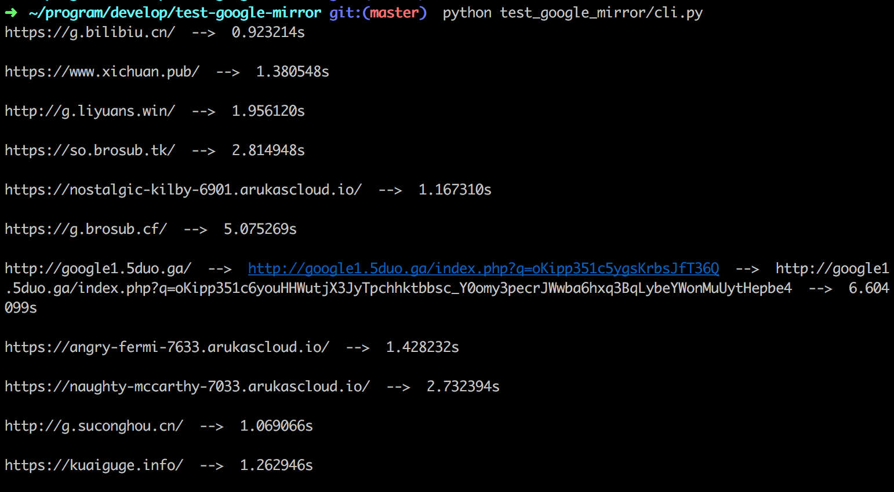

测试google mirror站点是否可用
===========================

安装依赖
========

python2:

	$ pip install requests

python3:

	$ python3 -m pip install requests

运行
====

	$ python test_google_mirror/cli.py

License
=======

MIT
